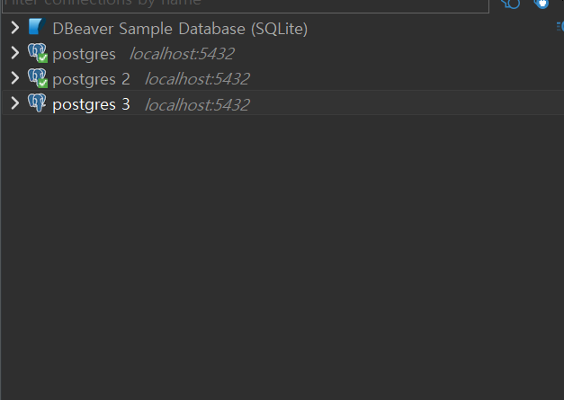
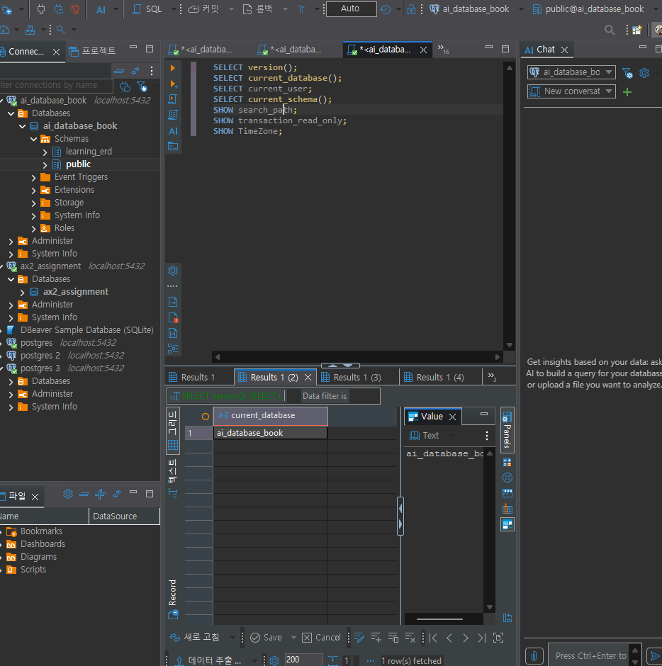
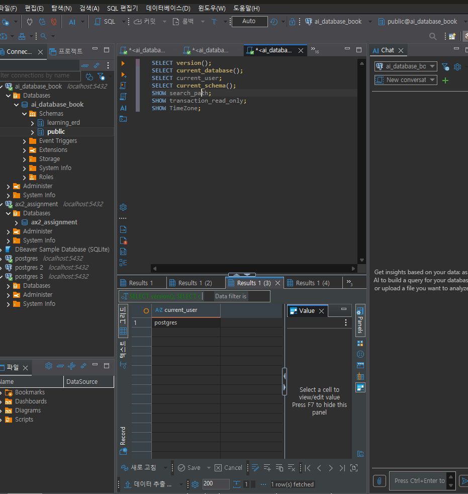
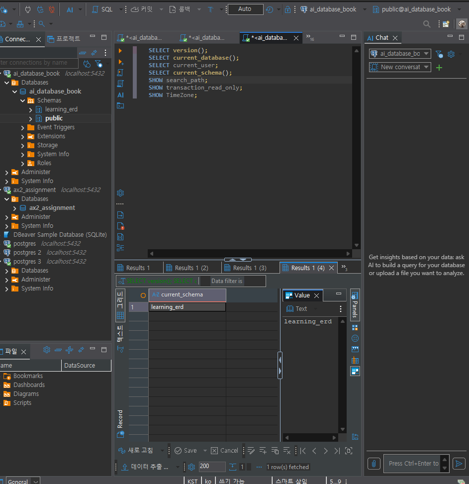
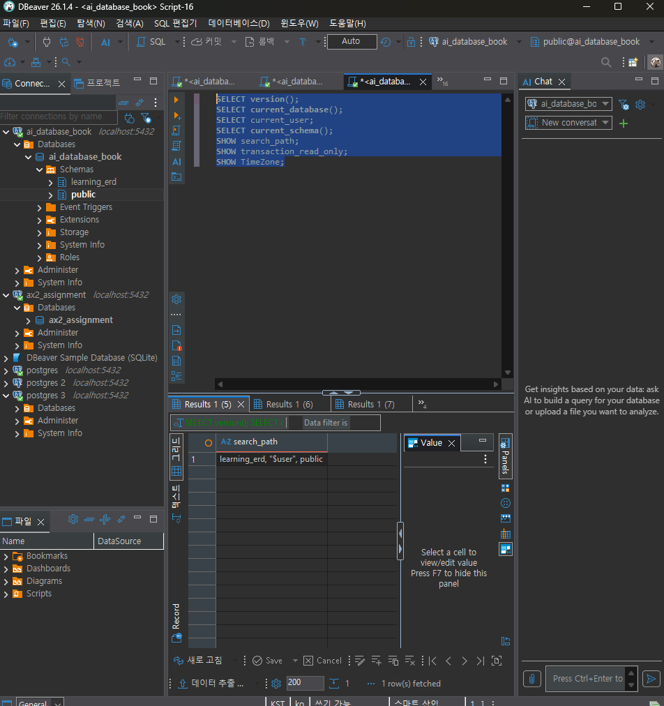
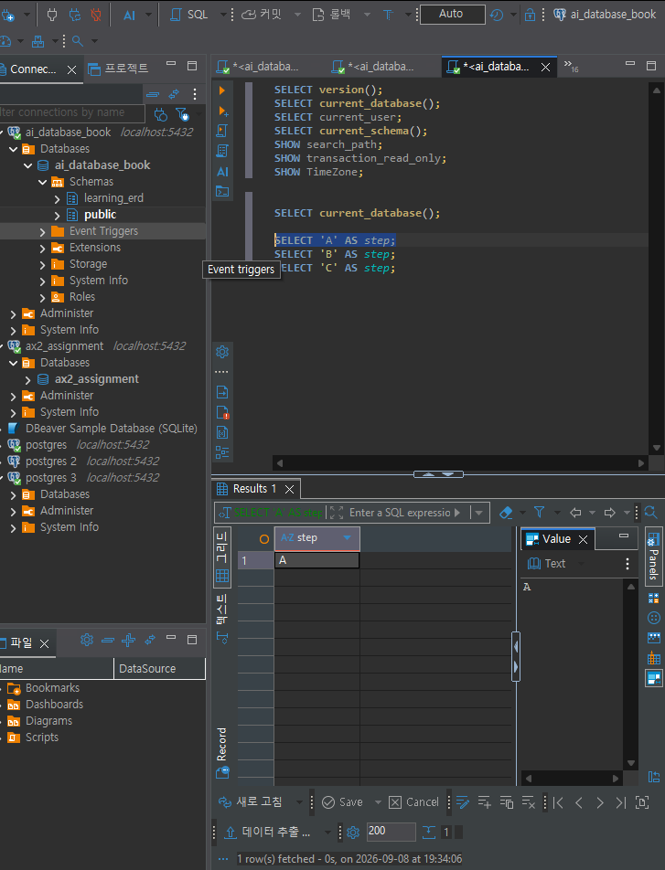
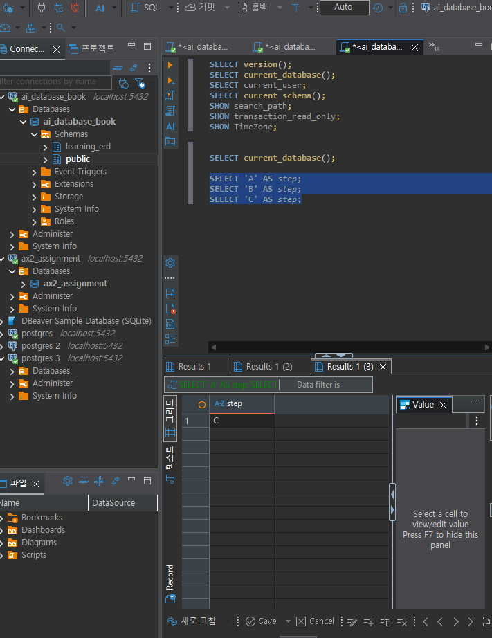

# Chapter 03 확장 실습 답안 템플릿

> **과제:** PostgreSQL과 DBeaver로 실습 환경 검증하기  
> **사용 방법:** 이 파일을 내려받아 본인의 GitHub 저장소에 `chapter03_answer.md`라는 이름으로 저장한 뒤 실습하면서 바로 작성합니다.  
> **제출 방법:** LMS에는 파일을 직접 업로드하지 않고, **본인 GitHub 저장소의 `chapter03_answer.md` 파일 URL**을 제출합니다.

---

## 제출 전 보안 주의

이 과제 파일과 캡처 화면에는 다음 정보를 올리지 않습니다.

```text
실제 PostgreSQL 비밀번호
전체 DB 접속 URL
API Key / Token
개인정보
공개할 필요가 없는 사내 서버 주소
```

LMS에서 제출자를 확인할 수 있으므로 공개 저장소의 답안 파일에 학번이나 실명을 반드시 적을 필요는 없습니다.

```text
GitHub 계정 또는 별칭: hiju200208-png
과제 작성일: 2026-09-08
사용한 AI 도구: chat gpt
```

---

# 1. PostgreSQL과 DBeaver 환경 확인

## 1-1. 내 환경

| 항목 | 작성 내용 |
| --- | --- |
| 운영체제 | Windows |
| PostgreSQL 버전 | PostgreSQL 18.4 on x86_64-windows, compiled by msvc-19.44.35227, 64-bit |
| DBeaver 버전 |  |
| Host | localhost |
| Port |5432 |
| Database | ai_database_book |
| Username | postgres |

> 비밀번호는 기록하지 않습니다.

## 1-2. PostgreSQL과 DBeaver 역할 설명

```text
PostgreSQL은: 데이터베이스를 관리하는 DBMS이다.

DBeaver는: PostgreSQL 같은 DBMS에 연결하여 SQL을 작성하고 실행할 수 있게 해주는 데이터베이스 관리 도구이다.

두 프로그램의 차이는: PostgreSQL은 실제 데이터를 저장하고 관리하는 DBMS이고
DBeaver는 PostgreSQL에 접속하여 데이터베이스를 편리하게 다룰 수 있도록 도와주는 프로그램이다.
```

---

# 2. 연결 테스트와 첫 SQL

## 2-1. DBeaver 연결 결과

- [x] PostgreSQL 연결 유형 선택
- [x] Host 확인
- [x] Port 확인
- [x] Database 확인
- [x] Username 확인
- [x] Test Connection 성공

### 연결 성공 화면

권장 이미지 경로:

```text
assignments/chapter03/images/step02_connection.png
```

`여기에 연결 성공 화면을 삽입하세요.`

## 2-2. 첫 SQL 실행

```sql
SELECT 1 + 1 AS result;
```

실행 전 예상:

```text
2
```

실제 결과:

```text
2
```

이 결과가 의미하는 것:

```text
DBeaver에서 SQL작성하고 PostgreSQL에 전달되어 계산하고 결과 반환이 잘 이루어졌다는 뜻
```

---

# 3. 현재 연결 위치를 SQL로 검증

다음 SQL을 실행합니다.

```sql
SELECT version();
SELECT current_database();
SELECT current_user;
SELECT current_schema();
SHOW search_path;
SHOW transaction_read_only;
SHOW TimeZone;
```

## 3-1. 결과 기록

| 확인 항목 | 실제 결과 | 내가 이해한 의미 |
| --- | --- | --- |
| `version()` | PostgreSQL 18.4 on x86_64-windows, compiled by msvc-19.44.35227, 64-bit | 내가 사용중인 DBMS의 버전 |
| `current_database()` | ai_database_book | 현재 연결해서 작업하고 있는 데이터베이스 이름 |
| `current_user` | postgres | 사용자 계정 |
| `current_schema()` | public | 현재 기본으로 사용되는 스키마 |
| `search_path` |"$user", public | 테이블 이름에 스키마를 생략했을 때 PostgreSQL이 어떤 스키마부터 찾아볼지 정해 놓은 검색 순서이다.  |
| `transaction_read_only` | off | 현재 트랜잭션이 읽기 전용이 아니므로 데이터를 생성·수정·삭제할 수 있다. |
| `TimeZone` | Asia/Seoul | PostgreSQL의 현재 시간대 설정이 한국 표준시(서울)로 되어 있다. |

## 3-2. 반드시 설명할 것

### DBeaver 연결 이름과 `current_database()`는 왜 같은 개념이 아닌가요?

```text

```

### `current_schema()`와 `search_path`는 어떤 관계가 있나요?

```text
DBeaver의 연결 이름은 사람이 알아보기 위해 붙인 별명이고 current_database()는 PostgreSQL에서 실제로 현재 접속한 데이터베이스 이름이기 때문이다.
```

### `transaction_read_only = off`라는 결과만으로 모든 테이블을 만들 권한이 있다고 단정할 수 있나요?

```text
off의 의미는 단순히 '현재 트랜잭션이 읽기 전용 상태가 아니다.' 라는 뜻이다.
하지만 실제로 CREATE TABLE을 할 수 있는지는 현재 사용자에게 해당 스키마에 테이블을 생성할 권한이 있는지도 따로 확인해야 한다.
```

## 3-3. 증거 화면

권장 경로:

```text
assignments/chapter03/images/step03_location_check.png
```

`여기에 현재 DB/사용자/스키마/search_path 결과 화면을 삽입하세요.`




---

# 4. `ai_database_book` 데이터베이스 확인

## 4-1. 현재 데이터베이스

```sql
SELECT current_database();
```

실제 결과:

```text
ai_database_book
```

- [x] 결과가 `ai_database_book`이다.
- [ ] 다른 DB라면 올바른 연결로 전환했다.

## 4-2. 연결을 바꾼 뒤 다시 검증

```text
전환 전 데이터베이스:ai_database_book
전환 후 데이터베이스:ai_database_book
전환 여부를 판단한 근거:원래부터 ai_database_book이였음
```

### 화면에서 보이는 연결 이름만 믿지 않고 SQL을 다시 실행해야 하는 이유

```text
DBeaver의 연결 이름은 사용자가 붙인 이름일 뿐이므로 실제 접속한 데이터베이스를 확인하려면 current_database()를 실행해야 한다.
```

---

# 5. SQL 실행 범위 실험

SQL Editor에 다음 세 문장을 입력합니다.

```sql
SELECT 'A' AS step;
SELECT 'B' AS step;
SELECT 'C' AS step;
```

## 5-1. 한 문장 실행

```text
내가 실행한 문장:SELECT 'A' AS step;
실제 결과:A
```

## 5-2. 선택 영역 실행

```text
선택한 문장: SELECT 'A' AS step;
SELECT 'B' AS step;
실제 결과: 한 문장 들여쓰기 됨
```

## 5-3. 전체 스크립트 실행

```text
실제 결과: C
결과 탭 또는 실행 순서에서 관찰한 점: 전체를 실행하면 마지막 줄만 실행된다.
```

## 5-4. 결과 해석

```text
한 문장 실행과 전체 스크립트 실행의 차이: 한 문장만 실행하면 그 문장이 실행되지만 전체 스크립트를 실행하면 마지막 문장만 실행된다.

변경 SQL에서 실행 범위를 잘못 선택하면 위험한 이유: 원래 조회만 하려 했는데 데이터 변경까지 일어날 수도 있기 때문이다.
```

### 증거 화면

권장 경로:

```text
assignments/chapter03/images/step05_execution_scope.png
```

`여기에 실행 범위 비교 화면을 삽입하세요.`



---

# 6. 제공된 환경 확인 SQL 실행

Public 저장소의 Chapter 03 파일을 사용합니다.

```text
code/chapter03/setup_check.sql
code/chapter03/setup_validate_local.sql
```

## 6-1. `setup_check.sql`

실행 결과에서 확인한 항목:

```text
PostgreSQL 버전:PostgreSQL 18.4 on x86_64-windows, compiled by msvc-19.44.35227, 64-bit
현재 DB:ai_database_book
현재 사용자:postgres
현재 스키마:public
search_path:"$user", public
읽기 전용 여부: off
TimeZone: Asia/Seoul
1 + 1 결과: 2
public 스키마 존재 여부: ㅇ
public USAGE 권한: ㅇ
public CREATE 권한: ㅇ
```

### 이 파일을 여러 번 실행해도 비교적 안전한 이유

```text
CREATE TABLE
INSERT
UPDATE
DELETE
DROP 다음 데이터 변경 명령을 포함하지 않기 때문이다.
```

## 6-2. `setup_validate_local.sql`

```text
실행 결과:
PASS / FAIL: pass
```

실패했다면 실패 항목:

```text
없음
```

그 실패가 실제 문제인지 환경 차이인지 판단한 근거:

```text
실패 없음
```

---

# 7. 안전한 오류 진단 실습

실제 오류가 있었다면 그 오류를 사용합니다. 오류가 없었다면 **데이터를 삭제하거나 서버를 강제로 중지하지 말고**, 안전한 SQL 문법 오류를 하나 만들어 관찰합니다.

예:

```sql
SELEC 1;
```

> 오류를 확인한 뒤 올바른 `SELECT 1;`로 복구합니다.

## 7-1. 오류 기록

```text
오류 메시지 핵심 문장: 구문 오류, "SELEC" 부근
  위치: 1

내가 먼저 생각한 원인 1: 스펠링이 틀려서

내가 먼저 생각한 원인 2: T가 빠져서

실제로 확인한 방법: T를 넣어봄

실제 원인: T가 빠짐

수정한 내용: T를 넣음
```

## 7-2. 수정 후 재검증

```sql
SELECT 1;
SELECT current_database();
```

```text
재검증 결과: 오류가 나지 않음
```

## 7-3. 오류를 유형으로 분류

- [ ] 서버 실행 문제
- [ ] Host 문제
- [ ] Port 문제
- [ ] Database 문제
- [ ] Username/인증 문제
- [X] SQL 문법 문제
- [ ] 권한 문제
- [ ] 기타

선택 이유: 실제로 문법이 틀렸었고 이를 수정하니 맞게 나왔기 때문이다.

```text

```

---

# 8. AI를 오류 분석 보조 도구로 사용

## 8-1. AI에게 전달한 프롬프트

비밀번호·개인정보·전체 접속 URL은 제거하고 기록합니다.

```text
나는 PostgreSQL과 DBeaver를 처음 배우는 학생입니다.

아래 오류를 바로 하나의 원인으로 단정하지 말고,

초보자가 안전하게 확인할 순서대로 분석해 주세요.

다음 형식으로 설명해 주세요.

1. 오류 메시지에서 확인되는 사실

2. 가능한 원인 후보

3. 각 원인을 확인하는 안전한 방법

4. 확인 결과에 따라 다음에 할 행동

5. 실행하면 위험할 수 있어 피해야 할 명령

실제 비밀번호나 개인정보는 포함하지 않았습니다.

SQL Error [42P01]: 오류: "public.students_test" 이름의 릴레이션(relation)이 없습니다
  위치: 16

Error position: line: 2 pos: 15
```

## 8-2. AI 답변 검토

| AI가 제안한 확인 방법 | 실제로 확인했는가? | 결과 | 수용 / 수정 / 거절 |
| --- | --- | --- | --- |
| 현재 데이터베이스부터 확인 | 네 | ai_database_book ㅣ 수용
|public 스키마가 있는지 확인 | 네 | public | 수용 |
| public에 실제 어떤 테이블이 있는지 확인 | 네 | students | 수용 |

### AI가 오류 원인을 너무 빨리 단정한 부분이 있었나요?

```text
아니오
```

### 오류 메시지와 실제 환경 중 무엇을 확인해서 최종 판단했나요?

```text
실제 환경
```

### AI 활용에서 가장 유용했던 점

```text
어떤 순서대로 오류를 확인할 수 있는지 알려준다
```

### AI 답변을 그대로 실행하지 않고 확인해야 하는 이유

```text
잘못 판단할 수도 있기 때문이다.
```

---

# 9. Chapter 01~02 개인 서비스와 연결

앞에서 선택한 개인 서비스가 PostgreSQL을 사용한다고 가정합니다.

```text
서비스 이름: 모아

사용할 데이터베이스 이름 후보: moa_db

사용할 스키마 이름 후보: moa

앞으로 만들고 싶은 테이블 후보 3개:
1. members
2. activities
3. activity_participations
```

### 아직 SQL을 만들지 않고 이름과 역할만 정하는 이유

```text
Chapter 04에서 기본 SQL을 익히고, Chapter 05에서 요구사항과 한 행의 의미, 관계를 더 정확하게 다룬 뒤 구조를 확정하기 때문이다.


```

### Chapter 02에서 정리했던 한 행의 의미 중 수정할 부분이 있나요?

```text
아니요
```

---

# 10. 초보자용 연결 가이드 작성

친구가 자신의 PC에서 같은 실습을 시작한다고 가정합니다. 아래 순서를 자신의 말로 작성합니다.

```text
1. PostgreSQL 서버가 실행되는지 확인하는 방법: DBeaver에서 PostgreSQL 서버에 정상적으로 연결되는지 확인한다.

2. DBeaver에서 PostgreSQL 연결을 만드는 방법: DBeaver에서 새 데이터베이스 연결을 선택하고 PostgreSQL을 선택한 뒤 Host, Port, Database, Username, Password 등의 접속 정보를 입력하고 Test Connection으로 연결이 되는지 확인한다.

3. Host / Port / Database / Username의 의미: Host는 PostgreSQL 서버가 실행되고 있는 위치이고 Port는 PostgreSQL 서버에 접속할 때 사용하는 통신 번호이다. Database는 접속하려는 데이터베이스의 이름이고
Username은 PostgreSQL에 접속할 때 사용하는 사용자 계정이다.


4. ai_database_book에 연결되었는지 확인하는 방법:DBeaver에 표시되는 연결 이름만 보고 판단하지 않고
SELECT current_database();를 실행하여 결과가 ai_database_book인지 확인한다.

5. 현재 위치를 확인하는 SQL: SELECT current_database();
SELECT current_schema();
SELECT current_user;


6. 한 문장과 전체 스크립트 실행을 구분해야 하는 이유: 실행 범위를 잘못 선택하면 필요한 SQL이
실행되지 않거나 의도하지 않은 SQL까지 함께 실행될 수 있기 때문에 현재 어떤 범위를 실행하는지 확인해야 한다.


7. 비밀번호를 GitHub나 AI 프롬프트에 넣으면 안 되는 이유:
```
비밀번호는 외부에 공개되면 다른 사람이 데이터베이스에 접근하는 데 사용될 수 있는 중요한 인증 정보이기 때문이다.
---

# 11. 최종 성찰

아래 문장은 반드시 본인의 말로 작성합니다.

```text
1. DBeaver와 PostgreSQL의 가장 중요한 차이는
   _____데이터베이스를 관리하는 DBMS인지 그걸 불러오고 보여주는 건지_________ 이다.

2. 내가 지금 어느 데이터베이스에 연결되어 있는지 확인할 때
   화면 이름만 보지 않고 __SELECT current_database();를 직접 실행해서 확인______ 해야 한다.

3. PostgreSQL 오류가 발생했을 때 가장 먼저 해야 할 일은
   _________오류메세지와 오류가 발생한 위치를 확인하는 것__________ 이다.

4. AI를 오류 해결에 사용할 때 가장 중요한 것은
   ________제안한 해결 방법이 안전한지 확인하는 것____________ 이다.
```

---

# 12. 제출 체크리스트

- [x] `chapter03_answer.md`의 빈 필수 항목을 작성했다.
- [x] PostgreSQL과 DBeaver의 역할 차이를 설명했다.
- [x] `current_database/current_user/current_schema/search_path`를 실제로 확인했다.
- [x] `ai_database_book` 연결 여부를 SQL로 검증했다.
- [x] SQL 실행 범위 세 가지를 비교했다.
- [x] `setup_check.sql`을 실행했다.
- [x] `setup_validate_local.sql` 결과를 확인했다.
- [x] 오류 원인을 먼저 스스로 추정한 뒤 AI를 사용했다.
- [x] AI 제안을 실제 환경에서 검증했다.
- [x] 핵심 캡처 3~4장만 골라 넣었다.
- [x] 캡처에 비밀번호·개인정보·전체 접속 URL이 없다.
- [x] Markdown 이미지가 GitHub 웹 화면에서 실제로 보인다.
- [x] 최종 답안 파일을 commit/push했다.

---

# 13. LMS 제출 URL

아래 형식의 **본인 GitHub 파일 URL**을 LMS에 제출합니다.

```text
https://github.com/<본인-GitHub-ID>/<본인-저장소>/blob/main/assignments/chapter03/chapter03_answer.md
```

내 제출 URL:

```text
https://github.com/hiju200208-png/ai-database-study/blob/main/chapter03/chapter03_answer.md
```

> 저장소 메인 URL, 교수자 템플릿 URL, Raw URL이 아니라 **작성 완료된 본인 `chapter03_answer.md` 파일 화면 URL**을 제출합니다.