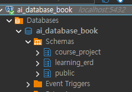
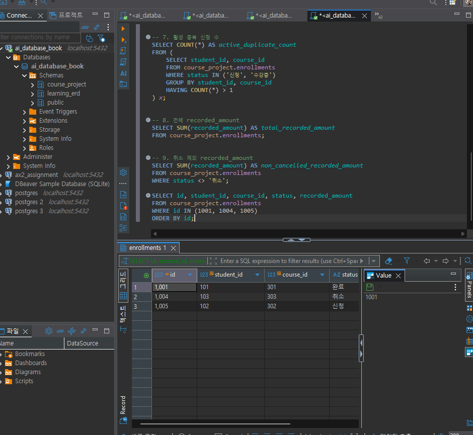
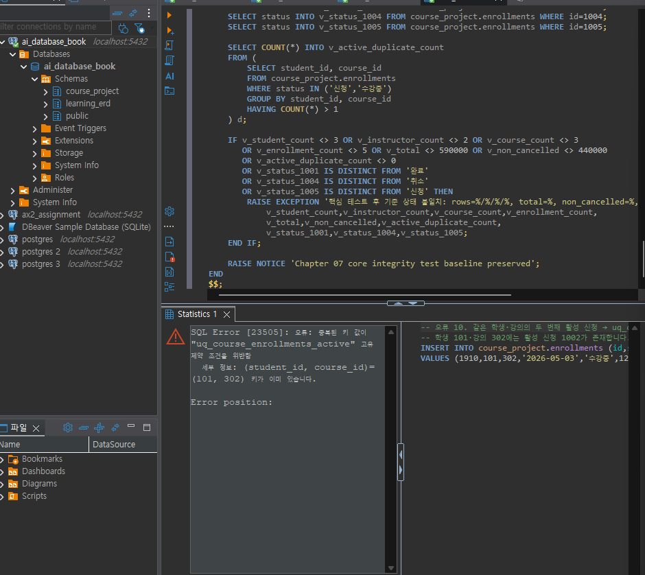
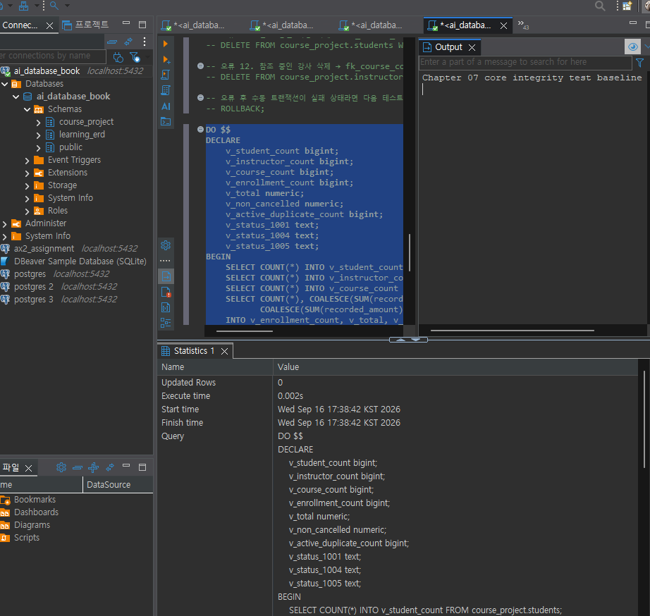
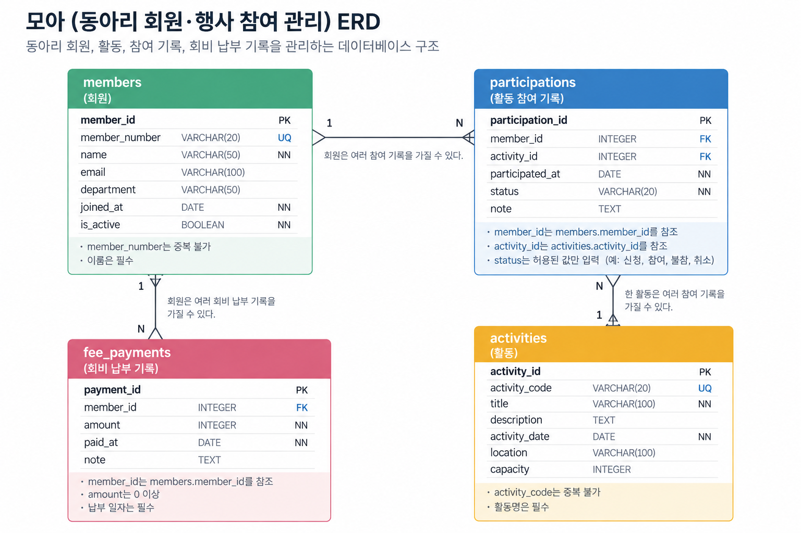

# Chapter 07 확장 실습 답안 템플릿

> **과제:** 실전 프로젝트 1 — 온라인 강의 수강신청 DB 완성하기  
> **사용 방법:** 이 파일을 내려받아 본인의 GitHub 저장소에 `chapter07_answer.md`라는 이름으로 저장한 뒤 실습하면서 바로 작성합니다.  
> **제출 방법:** LMS에는 파일을 직접 업로드하지 않고, **본인 GitHub 저장소의 `chapter07_answer.md` 파일 URL**을 제출합니다.

---

## 제출 전 주의

이 파일과 캡처 화면에는 실제 비밀번호, 전체 DB 접속 URL, API Key, 개인정보를 기록하지 않습니다.

```text
GitHub 계정 또는 별칭: hiju200208-png
과제 작성일: 2026-09-15
사용한 AI 도구: chat gpt
```

---

# 1. 시작 환경 확인

다음을 실행합니다.

```sql
SELECT current_database();
SELECT current_user;
SELECT current_schema();
SHOW search_path;
SHOW transaction_read_only;
```

| 확인 항목 | 실제 결과 | 의미 |
| --- | --- | --- |
| `current_database()` | ai_database_book | 현재 사용중인 데이터베이스 |
| `current_user` | postgres | 현재 사용자 계정 |
| `current_schema()` | public |사용중인 스키마 |
| `search_path` | "$user", public | 스키마 이름을 생략했을 때 PostgreSQL이 테이블 등을 찾는 스키마 검색 순서 |
| `transaction_read_only` | off | 읽기 전용이 아님 |

- [x] 현재 DB가 `ai_database_book`이다.
- [x] 쓰기 가능한 연결인지 확인했다.
- [x] 실행할 SQL 범위를 확인했다.
- [x] Auto-commit 상태를 확인했다.

### 프로젝트 SQL을 실행하기 전에 시작 상태를 확인해야 하는 이유

```text
프로젝트 SQL 실행 전 시작 상태를 확인하는 이유는 현재 데이터베이스의 구조와 데이터를 파악하여 기존 데이터와의 충돌이나 중복, 잘못된 변경을 방지하고 SQL 실행 결과를 정확하게 비교하기 위해서이다.
```

---

# 2. 프로젝트 범위와 요구사항 읽기

## 2-1. 포함 범위

본문을 그대로 복사하지 말고 자신의 말로 정리합니다.

```text
1.학생,강사
2.강의
3.수강신청, 신청상태
4.강의 기준 가격, 신청 시 기록 금액
```

## 2-2. 제외 범위

```text
1.실제 결제 시도·승인·실패·환불 이력
2.강의 정원과 대기열,상태 변경 전체 이력
3.진도·수료·강의 콘텐츠
4.수강평·쿠폰·할인 적용 이력
```

### 범위를 명확하게 정해야 하는 이유

```text
범위를 정해야 현재 학습 범위 안에서 정확하게 설계하고 재현 가능하게 검증할 수 있기 때문이다.
```

## 2-3. 요구사항 / 프로젝트 결정 / 미확정 질문 구분

아래 항목 중 대표 항목을 정리합니다.

| ID | 종류 | 내용 요약 | DB 구조/규칙에 미치는 영향 |
| --- | --- | --- | --- |
| P07-R01 | 요구사항 | 학생은 이름, 이메일과 가입일을 가진다. | 학생 테이블에 이름,이메일,가입일을 저장할 컬럼이 필요하다 |
| P07-R05 | 요구사항 | 	
수강신청은 학생, 강의, 신청일, 상태와 신청 시 기록 금액을 가진다.| 수강신청 테이블에 학생,강의,신청일, 상태와 신청 시 기록 금액을 저장할 컬럼이 필요하다. |
| P07-R07 | 요구사항 | 학생·강사 이메일은 각 테이블 안에서 공백·동일 문자열 중복이 허용되지 않는다. | 이메일 컬럼에 NOT NULL, UNIQUE를 적용하고 빈 문자열을 허용하지 않는 검증 규칙이 필요하다. |
| P07-D02 | 프로젝트 결정 | 	
할인 기능이 없는 현재 범위에서는 신청 생성 시 courses.price를 recorded_amount에 복사해 보존 | courses.price와 recorded_amount가 동일함 |
| P07-D03 | 프로젝트 결정 | 	
진행 중 중복 신청 금지 | 진행 중에는 중복으로 신청할 수 없음 |
| P07-Q01 | 미확정 질문 | 학생과 강사 사이에서도 이메일을 전역 고유하게 제한해야 하는가? | 이걸로 고유조건이 변경될 수도 있음 |

### 미확정 질문을 바로 제약조건으로 만들면 안 되는 이유

```text
잘못된 부분까지 제약할 수 있기 때문이다.
```

---

# 3. 네 테이블의 한 행 의미와 관계

## 3-1. 한 행 의미

```text
course_project.students 한 행 = 학생 한 명

course_project.instructors 한 행 = 강사 한 명

course_project.courses 한 행 = 개설된 강의 한 개

course_project.enrollments 한 행 = 특정 학생이 특정 강의에 신청한 사건 한 건
```

## 3-2. 키와 중요 규칙

| 테이블 | PK | FK | 중요 규칙 |
| --- | --- | --- | --- |
| students | id | 없음 | 이메일은 필수이며 중복불가 |
| instructors | id | 없음 | 이메일은 필수이며 중복불가 |
| courses | id | instructor_id → instructors.id | 하나의 강의는 한명의 강사를 참조 |
| enrollments | id | student_id → students.id, course_id → courses.id | 동일 학생의 동일 강의 중복 수강신청 불가 |

## 3-3. 관계를 양방향 문장으로 작성

```text
instructors ↔ courses: 한 강사는 여러 강의를 담당할 수 있다. 한 강의는 한 명의 강사가 담당한다.

students ↔ enrollments: 한 학생은 여러 수강신청을 할 수 있다. 한 수강신청은  한 학생에 속한다.

courses ↔ enrollments: 한 강의는 여러 수강신청을 가질 수 있다. 한 수강신청은 하나의 강의에 속한다.
```

### 학생과 강의의 N:M 관계가 `enrollments`를 통해 어떻게 바뀌는지 설명

```text
enrollments를 통해 1:n관계로 바뀐다
```

### `enrollments`가 단순 연결 테이블이 아니라 사건 테이블이라고 볼 수 있는 이유

```text
등록 시간 상태 등의 사건 속성을 가지기 때문이다.
```

---

# 4. `recorded_amount`의 의미 이해

```text
courses.price = 강의 기준 가격

enrollments.recorded_amount = 신청시 기록 금액
```

### 두 값이 처음에는 같아도 같은 의미가 아닌 이유

```text
쿠폰 및 할인 기능이 있을 경우 달라질 수 있기 때문이다.
```

### `recorded_amount`를 실제 결제 성공액이나 회계 매출로 해석하면 안 되는 이유

```text
recorded_amount는 시스템에 기록된 금액일 뿐 실제 결제 성공 여부나 환불·취소 여부를
확인할 수 없으므로 실제 결제 성공액이나 회계 매출로 해석하면 안 된다.
```

---

# 5. STEP 01 — 스키마와 테이블 생성

실행 파일:

```text
code/chapter07/01_course_project_schema.sql
```

## 5-1. 실행 전 예상

```text
course_project 스키마 존재 여부: ㅇ
예상 테이블 수: 4개
예상 데이터 행 수: 0행
예상되는 명명 제약조건 수: 15개
예상되는 NOT NULL 열 수: 모름
부분 고유 인덱스 존재 여부: 모름
```

## 5-2. 실행 결과

```text
실제 테이블 수:4
실제 명명 제약조건 수: 10
실제 NOT NULL 열 수: 20
부분 고유 인덱스: 존재
네 테이블의 실제 행 수: 0
통과 메시지: ㅇ
```

### 예상과 실제 비교

```text
명명 제약조건 수가 다름
```

### 증거 화면

권장 경로:

```text
assignments/chapter07/images/step05_schema.png
```

`여기에 스키마/테이블 생성 검증 화면을 삽입하세요.`

---

# 6. STEP 02 — Seed 데이터 입력

실행 파일:

```text
code/chapter07/02_course_project_seed.sql
```

## 6-1. 실행 전 예상

```text
students: 3
instructors: 2
courses: 3
enrollments: 4
recorded_amount 합계: 470000
학생 101 신청 건수: 2
강의 301 신청 건수: 2
강사 201 담당 강의 수: 2
활성 중복 신청: 0
```

## 6-2. 실제 결과

```text
students: 3
instructors: 2
courses: 3
enrollments: 4
recorded_amount 합계: 470000
학생 101 신청 건수: 2
강의 301 신청 건수: 2
강사 201 담당 강의 수: 2
1001 상태: 수강중
1004 상태:신청
1005 존재 여부: x
통과 메시지: ㅇ
```

### Seed 데이터를 단순 예제가 아니라 검증 데이터라고 볼 수 있는 이유

```text

1:N 관계가 실제로 만들어지는가?

같은 학생에게 여러 신청이 가능한가?

같은 강의에 여러 학생 신청이 가능한가?

상태가 여러 종류로 존재하는가?

금액 검산이 가능한가?
등을 확인하기 위한 것이기 때문이다.
```

---

# 7. STEP 03 — 변경 시나리오 실행

실행 파일:

```text
code/chapter07/03_course_project_changes.sql
```

## 7-1. 실행 전에 상태 변화를 예상

| 신청 ID | 변경 전 예상 상태 | 변경 후 예상 상태 | 예상 recorded_amount |
| ---: | --- | --- | ---: |
| 1001 |수강중 | 완료 | 590000 |
| 1004 | 신청 | 취소 | 590000 |
| 1005 | x | 신청 | 590000 |

```text
변경 후 예상 enrollments 행 수: 
변경 후 예상 전체 recorded_amount 합계: 590000
변경 후 예상 취소 제외 건수: 4건
변경 후 예상 취소 제외 recorded_amount 합계: 440000
```

## 7-2. 실제 결과

```text
1001 상태 / recorded_amount: 완료/100000
1004 상태 / recorded_amount: 취소/150000
1005 상태 / recorded_amount: 신청/120000
최종 enrollments 행 수: 5
전체 recorded_amount 합계: 590000
취소 제외 건수: 4
취소 제외 recorded_amount 합계: 440000
활성 중복 신청: 없음
통과 메시지: ㅇ
```

### 조건부 UPDATE에서 예상 이전 상태를 확인해야 하는 이유

```text
예상과 다른 상태인데도 UPDATE를 계속하면 이미 다른 작업이 진행된 데이터를 덮어쓸 수 있어서


```

### 증거 화면

권장 경로:

```text
assignments/chapter07/images/step07_changes.png
```

`여기에 주요 변경 전/후 결과를 삽입하세요.`


이미 변경 후라 전 캡처본은 생략했습니다
---

# 8. STEP 04 — 최종 완료 게이트 실행

실행 파일:

```text
code/chapter07/04_course_project_validation.sql
```

## 8-1. 최종 검증 결과

```text
최종 행 수 students/instructors/courses/enrollments:3/2/3/5
서비스 JOIN 결과 행 수: 5
학생 101 신청 수: 2
강의 301 신청 수: 2
강사 201 강의 수: 2
고아 관계 수: 0
활성 중복 신청 수: 0
전체 recorded_amount: 590000
취소 제외 recorded_amount: 440000
통과 메시지: ㅇ
```

### SQL 파일 4개가 모두 실행되었다는 사실과 프로젝트 검증 PASS가 다른 이유

```text
SQL 파일 4개가 모두 실행되었다는 것은 SQL 문법상 오류 없이 작업이 수행되었다는 의미일 뿐이다. 프로젝트 검증 PASS는 최종 데이터베이스의 테이블 구조, 제약조건, 데이터 관계, 중복 여부, 집계 결과 등이 프로젝트 요구사항을 실제로 만족하는지까지 확인한 결과이므로 서로 다르다.
```

### 증거 화면

권장 경로:

```text
assignments/chapter07/images/step08_validation.png
```

`여기에 최종 validation PASS 화면을 삽입하세요.`

---

# 9. 무결성 테스트

실행 파일:

```text
code/chapter07/05_course_project_integrity_tests.sql
```

> 오류 테스트는 파일 전체를 무작정 실행하지 않고 **한 테스트 구간씩** 실행합니다.

## 9-1. 허용되어야 하는 경계값 1개

```text
테스트 내용: 경계 테스트 A. 무료 강의 price=0, description=NULL, 무료 신청 recorded_amount=0 허용
기대 결과: 성공 후 임시 행 삭제
실제 결과: 임시 행이 삭제됨
왜 허용되어야 하는가: 무료 강의나 비용이 발생하지 않는 수강신청도 존재할 수 있으므로
recorded_amount는 0이 될 수 있다.
```

## 9-2. 실패해야 하는 테스트 1 — 잘못된 참조 또는 값

```text
테스트 내용: price가 -1인 강의를 INSERT하였다.
기대 결과: 음수 가격은 허용되지 않으므로 INSERT가 실패해야 한다.
실제 오류 핵심:courses 테이블의 CHECK 제약조건 위반으로 INSERT가 실패하였다.
동작한 제약조건/규칙:chk_course_courses_price
왜 실패해야 하는가: 강의 가격은 0 이상이어야 하며 음수 가격은 유효한 강의 가격이 아니기 때문이다.
```

## 9-3. 실패해야 하는 테스트 2 — 활성 중복 신청

```text
테스트 내용:  이미 활성 신청이 존재하는 학생 101·강의 302 조합에 두 번째 활성 상태인 '수강중' 신청을 INSERT하였다.
기대 결과: 동일 학생·강의에 활성 신청이 중복될 수 없으므로 INSERT가 실패해야 한다.
실제 오류 핵심: 중복 키 값이 고유 제약조건(인덱스)을 위반하여 INSERT가 실패하였다.
동작한 인덱스/규칙: uq_course_enrollments_active
왜 실패해야 하는가: 동일한 학생이 동일한 강의에 '신청' 또는 '수강중' 상태의 활성 신청을 동시에 두 건 이상 가질 수 없기 때문이다.
```

## 9-4. 실패 후 기준 상태 재검증

```text
04 validation 재실행 결과: pass
기준 데이터가 유지되었는가: 네
```

### 실패 테스트가 프로젝트 품질 검증에 필요한 이유

```text
실패 테스트를 통해 잘못된 데이터가 DB에 저장되지 않는지 확인하고 설정한 제약조건과 무결성 규칙이 실제로 동작하는지 검증할 수 있다.
```

### 증거 화면

권장 경로:

```text
assignments/chapter07/images/step09_integrity.png
```

`여기에 대표 실패 테스트와 기준 상태 유지 결과를 삽입하세요.`


---

# 10. 재현성 실험

> 이 단계는 본인의 실습 환경이며 보존할 데이터가 없을 때만 수행합니다.

실행 순서:

```text
reset_course_project.sql
→ 01_course_project_schema.sql
→ 02_course_project_seed.sql
→ 03_course_project_changes.sql
→ 04_course_project_validation.sql
```

```text
처음 실행의 최종 결과:
재실행의 최종 결과:
두 결과가 일치했는가:
중간에 수동 수정이 필요했는가:
```

### 다른 사람이 같은 순서로 실행해 같은 결과를 얻는 것이 중요한 이유

```text

```

---

# 11. Chapter 01~06 개인 프로젝트를 중간 프로젝트 초안으로 확장

온라인 강의 예제를 이름만 바꾸지 않고 본인의 아이디어를 사용합니다.

## 11-1. 프로젝트 기본 정보

```text
프로젝트 이름: 모아

해결하려는 문제: 동아리 회원·행사 참여 관리

주요 사용자: 동아리 회장
```

## 11-2. 포함 범위 / 제외 범위

```text
[포함]
1. 동아리 회원 정보 등록 및 관리
2. 동아리 활동 정보 등록 및 관리
3. 회원별 활동 참여 기록 관리
4. 활동별 참여 회원 조회

[제외]
1. 실제 회비 결제 및 온라인 결제 기능
2. 동아리 가입 승인·탈퇴 처리 자동화
3. 문자·이메일·푸시 알림 기능
```

## 11-3. 요구사항

최소 8개를 작성합니다.

| ID | 요구사항 | 관련 테이블/관계 | 검증 방법 후보 |
| --- | --- | --- | --- |
| P07-MR01 | 회원의 이름, 회원번호, 이메일, 가입일을 저장한다. | members | SELECT로 저장 값 확인 |
| P07-MR02 |회원번호는 회원마다 중복되지 않는다. | members | 동일 회원번호 INSERT 실패 확인 |
| P07-MR03 | 활동의 활동코드, 활동명, 활동일을 저장한다. | activities | SELECT로 저장 값 확인 |
| P07-MR04 | 활동코드는 활동마다 중복되지 않는다. | activities | 동일 활동코드 INSERT 실패 확인 |
| P07-MR05 | 한 회원은 여러 활동에 참여할 수 있다. | members ↔ participations | 회원별 참여 건수 COUNT |
| P07-MR06 | 한 활동에는 여러 회원이 참여할 수 있다. | activities ↔ participations | 활동별 참여 건수 COUNT |
| P07-MR07 | 참여 기록은 존재하는 회원과 활동만 참조할 수 있다. | participations → members, activities |존재하지 않는 ID의 INSERT 실패 확인 |
| P07-MR08 | 참여 기록에는 참여 상태를 저장한다. | participations | 허용된 상태와 잘못된 상태 입력 테스트 |

## 11-4. 프로젝트 결정

최소 3개를 작성합니다.

| ID | 이번 프로젝트에서 내린 결정 | 이유 | 구현 후보 |
| --- | --- | --- | --- |
| P07-MD01 | 각 테이블에 자동 증가 내부 ID를 PK로 사용한다. | 업무 데이터가 변경되어도 행을 안정적으로 식별하기 위해 | GENERATED ... AS IDENTITY PRIMARY KEY |
| P07-MD02 | 회원과 활동의 N:M 관계를 participations로 분리한다. | 한 회원은 여러 활동에, 한 활동에는 여러 회원이 참여할 수 있기 때문 | participations 중간 테이블 |
| P07-MD03 | 회원번호와 활동코드는 내부 PK와 별도의 업무 식별자로 관리한다. | 실제 업무에서 사용하는 번호와 DB 내부 식별자를 구분하기 위해 | UNIQUE |

## 11-5. 미확정 질문

최소 3개를 작성합니다.

```text
P07-MQ01. 회원이 탈퇴했을 때 기존 활동 참여 기록을 유지할지 삭제할지 아직 결정하지 않았다.
P07-MQ02. 한 회원이 동일한 활동에 여러 번 참여 기록을 가질 수 있는지 아직 결정하지 않았다.
P07-MQ03. 회비 기능의 경우 분할 납부와 납부 취소를 어떻게 처리할지 아직 결정하지 않았다.
```

---

# 12. 개인 프로젝트 ERD와 한 행 의미

## 12-1. 테이블 후보

최소 4개를 권장합니다.

| 테이블 | 한 행의 의미 | PK 후보 | FK 후보 | 주요 규칙 |
| --- | --- | --- | --- | --- |
| members | 동아리 회원 한 명 | member_id | 없음 | member_number 중복 불가, 이름 필수 |
| activities | 동아리 활동 한 건 | activity_id | 없음 | activity_code 중복 불가, 활동명 필수 |
| participations | 회원 한 명의 활동 참여 한 건 | participation_id | member_id, activity_id | 존재하는 회원·활동만 참조, 참여 상태 제한 |
| fee_payments | 회원의 회비 납부 기록 한 건 | payment_id | member_id | 존재하는 회원만 참조, 납부 금액은 0 이상 |

## 12-2. 관계 문장

```text
1.한 회원은 여러 활동 참여 기록을 가질 수 있고, 한 참여 기록은 한 명의 회원을 참조한다.
2. 한 활동은 여러 회원의 참여 기록을 가질 수 있고, 한 참여 기록은 하나의 활동을 참조한다.
3. 한 회원은 여러 회비 납부 기록을 가질 수 있고, 한 회비 납부 기록은 한 명의 회원을 참조한다.
```

## 12-3. ERD

권장 이미지 경로:

```text
assignments/chapter07/images/personal_project_erd.png
```

`여기에 본인의 ERD 이미지를 삽입하세요.`


### Chapter 05~06 ERD에서 이번에 바꾼 점

```text
각 테이블 안에 들어갈 내용들도 확인함
```

---

# 13. 개인 프로젝트 완료 기준 만들기

“잘 동작한다”처럼 모호하게 쓰지 말고 검증 가능한 기준을 최소 6개 작성합니다.

| 번호 | 완료 기준 | 자동 SQL 검증 가능? | 검증 방법 |
| ---: | --- | --- | --- |
| 1 | members, activities, participations, fee_payments 4개 테이블이 모두 존재한다. | 가능 | information_schema.tables에서 테이블 수 확인 |
| 2 |모든 participations.member_id는 실제 존재하는 회원을 참조한다. | 가능 | LEFT JOIN으로 고아 관계가 0건인지 확인 |
| 3 | 모든 participations.activity_id는 실제 존재하는 활동을 참조한다. | 가능 | LEFT JOIN으로 고아 관계가 0건인지 확인 |
| 4 | 모든 fee_payments.member_id는 실제 존재하는 회원을 참조한다. | 가능 | LEFT JOIN으로 고아 관계가 0건인지 확인 |
| 5 |동일한 member_number는 중복 저장되지 않는다. | 가능 | 동일 회원번호로 INSERT하여 실패하는지 확인 |
| 6 | 회비 납부 금액 amount에는 음수가 저장되지 않는다. | 가능 | amount = -1로 INSERT하여 실패하는지 확인 |

예시 형식:

```text
Seed 실행 후 A/B/C/D 테이블의 행 수가 각각 5/3/8/12다.
존재하지 않는 부모를 참조하는 행은 0건이다.
허용되지 않은 상태 입력은 DB가 거부한다.
검증 SQL이 예상 결과를 반환한다.
```

---

# 14. AI를 프로젝트 리뷰어로 사용

AI에게 프로젝트를 대신 완성시키지 않고 누락과 위험을 찾게 합니다.

## 14-1. AI에게 전달한 핵심 자료

```text
요구사항: 
동아리 회원, 활동, 활동 참여 기록, 회비 납부 기록을 관리한다.
회원번호와 활동코드는 중복되지 않아야 한다.
참여 기록은 존재하는 회원과 활동만 참조해야 한다.
회비 납부 기록은 존재하는 회원만 참조해야 한다.


테이블/ERD 설명: 
members: 회원 한 명을 저장한다.
activities: 동아리 활동 한 건을 저장한다.
participations: 회원 한 명의 활동 참여 한 건을 저장한다.
fee_payments: 회원의 회비 납부 한 건을 저장한다.

members와 activities는 participations를 통해 연결된다.
members와 fee_payments는 1:N 관계이다.

프로젝트 결정:
각 테이블에 내부 ID를 PK로 사용한다.
member_number와 activity_code는 업무 식별자로 별도 관리한다.
회원과 활동의 N:M 관계를 participations 테이블로 분리한다.

미확정 질문:
동일 회원의 동일 활동 중복 참여를 허용할지 결정하지 않았다.
회원 탈퇴 시 기존 참여 및 회비 기록을 어떻게 처리할지 결정하지 않았다.
회비의 분할 납부와 납부 취소를 어떻게 처리할지 결정하지 않았다.

완료 기준:
4개 테이블 존재 여부를 확인한다.
FK 고아 관계가 0건인지 확인한다.
회원번호와 활동코드 중복 입력이 거부되는지 확인한다.
잘못된 참여 상태 및 음수 회비 금액이 거부되는지 확인한다.
```

## 14-2. 내가 사용한 프롬프트

```text
나는 데이터베이스 초보자이고 Chapter 07까지 학습했습니다.
개인 프로젝트 '모아'의 DB 구조를 검토해 주세요.

현재 테이블은 members, activities, participations, fee_payments 총 4개입니다.

프로젝트를 대신 완성하지 말고 요구사항과 테이블 구조가 일치하는지, PK와 FK 관계가 적절한지, 데이터 무결성에
문제가 될 수 있는 부분이 있는지 검토해 주세요.

특히 아직 결정하지 않은 회원 탈퇴 처리, 동일 활동 중복 참여, 회비 분할 납부 및 취소 정책은 임의로 결정하지 말고
미확정 사항으로 구분해 주세요.

아직 배우지 않은 고급 데이터베이스 기능이 필요하다면 바로 적용하지 말고 별도로 알려 주세요.
```

## 14-3. AI 제안 검토

| AI 제안 | 수용 / 수정 / 보류 / 거절 | 실제 근거 | 반영 내용 |
| --- | --- | --- | --- |
| member_number에 중복 방지 규칙 적용 | 수용 | 서로 다른 회원이 동일한 회원번호를 가지면 회원 식별이 어려움 | UNIQUE 후보로 설정 |
| participations에 회원·활동 FK 적용 | 수용 | 존재하지 않는 회원이나 활동의 참여 기록을 방지해야 함 | member_id, activity_id를 FK로 설정 |
| fee_payments.member_id에 FK 적용 | 수용 | 존재하지 않는 회원의 회비 납부 기록을 방지해야 함 | members.member_id를 참조하도록 설정 |
|동일 회원·활동의 참여 기록을 무조건 하나로 제한 | 보류 | 동일 활동 재참여를 허용할지 아직 결정하지 않음 | 미확정 질문으로 유지 |

### AI가 미확정 정책을 임의로 확정하려 한 부분이 있었나요?

```text
동일 회원·활동의 참여 기록을 무조건 하나로 제한 
```

### AI가 제안한 규칙 중 아직 배우지 않은 기능이라 보류한 것이 있나요?

```text
회원 삭제 시 참여 기록과 회비 납부 기록을 자동으로 처리하는 방식이나 복잡한 조건에 따라 데이터를 자동 변경하는 기능은 현재 학습 범위를 넘어갈 수 있어 바로 적용하지 않았다.
```

### AI 활용 후 실제로 좋아진 부분

```text
members, activities, participations, fee_payments의 한 행 의미와 각 테이블 사이의 관계를 더 명확하게 정리할 수 있었다.
```

---

# 15. 최종 성찰

아래 문장은 반드시 본인의 말로 작성합니다.

```text
1. 데이터베이스 프로젝트가 완료되었다고 판단하려면
   SQL 파일의 존재보다 _____요구사항과 완료 기준을 실제로 만족하는지 검증하는 것_____ 이 중요하다.

2. Seed 데이터의 목적은 단순히 화면을 채우는 것이 아니라
   __________실제 사용 상황과 비슷한 데이터를 준비하여 조회·관계·제약조건 등이 올바르게 동작하는지 검증하는 것_______________ 이다.

3. 실패 테스트가 필요한 이유는
   ____________잘못된 값이나 참조가 DB에 저장되지 않고 제약조건이 의도대로 동작하는지 확인하기 위해서_______________ 이다.

4. 요구사항과 프로젝트 결정을 구분해야 하는 이유는
   ________서비스에 반드시 필요한 조건과 그 조건을 구현하기 위해 내가 선택한 방법을 구분하기 위해서________ 이다.

5. 내가 만든 개인 프로젝트에서 가장 먼저 추가 확인해야 할 정책은
   ___________동일한 회원이 동일한 활동에 여러 번 참여할 수 있는지 여부___________ 이다.
```

---

# 16. 제출 체크리스트

- [x] `chapter07_answer.md`를 본인 저장소에 만들었다.
- [x] 시작 환경과 현재 DB를 확인했다.
- [x] 프로젝트 포함/제외 범위를 설명했다.
- [x] 요구사항/결정/미확정 질문을 구분했다.
- [x] 네 테이블의 한 행 의미와 관계를 설명했다.
- [x] `01_course_project_schema.sql`을 실행하고 결과를 확인했다.
- [x] `02_course_project_seed.sql`의 기준 상태를 확인했다.
- [x] `03_course_project_changes.sql` 전후 상태를 비교했다.
- [x] `04_course_project_validation.sql` PASS를 확인했다.
- [x] 허용 경계값 1개 이상을 확인했다.
- [x] 실패 테스트 2개 이상을 한 구간씩 실행했다.
- [x] 실패 후 validation을 다시 실행했다.
- [x] 개인 프로젝트 요구사항 8개 이상을 작성했다.
- [x] 프로젝트 결정 3개 이상과 미확정 질문 3개 이상을 작성했다.
- [x] 개인 프로젝트 ERD를 작성했다.
- [x] 검증 가능한 완료 기준 6개 이상을 작성했다.
- [x] AI 제안을 수용/수정/보류/거절로 구분했다.
- [x] 핵심 캡처는 3~4장 정도로 정리했다.
- [x] 캡처에 비밀번호나 개인정보가 없다.
- [x] GitHub 웹에서 Markdown과 이미지가 정상적으로 보인다.
- [x] 최종 파일을 commit/push했다.

---

# 17. LMS 제출 URL

아래 형식의 **본인 GitHub 파일 URL**을 LMS에 제출합니다.

```text
https://github.com/<본인-GitHub-ID>/<본인-저장소>/blob/main/assignments/chapter07/chapter07_answer.md
```

내 제출 URL:

```text

```

> 저장소 메인 URL, 교수자 템플릿 URL, Raw URL이 아니라 **작성 완료된 본인 `chapter07_answer.md` 파일 화면 URL**을 제출합니다.